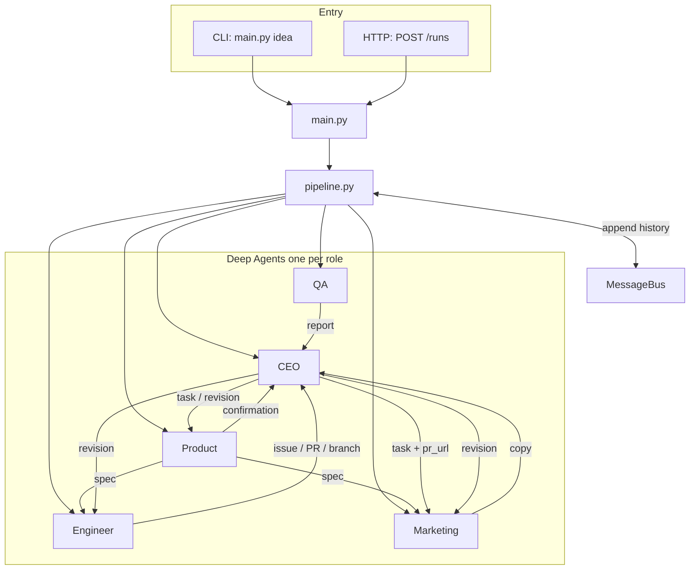

# LaunchMind

Multi-agent system that takes a startup **idea** and runs a micro-startup workflow: **Product** spec, **Engineer** landing page + real **GitHub** issue/branch/PR, **Marketing** cold email (**Resend**) + **Slack** Block Kit post (PR URL comes from the **CEO** only), **QA** inline PR comments, **CEO** orchestration with LLM reviews and multiple revision loops, and a final CEO summary to Slack.

Course PR: [LaunchMind #21](https://github.com/Talha-Ali-5365/LaunchMind/pull/21).

Built with **FastAPI**, **LangChain Deep Agents** ([quickstart](https://docs.langchain.com/oss/python/deepagents/quickstart)), and **OpenAI-compatible** chat (`langchain-openai` `ChatOpenAI`, e.g. Metaminds `base_url`).

## Startup idea

**WarmTrail**: B2B **revenue pipeline** software for SMB and mid-market teams: it **finds** ICP-fit accounts from public signals (hiring, tech stack hints, news, intent-style triggers you configure), **warms** them with research-backed, on-brand outreach drafts, then **chases** with polite, spaced follow-ups until someone replies, opts out, or gets handed to your CRM or calendar. Position it as the teammate that never forgets a thread, without replacing the human: approval queues for first touch, clear opt-out handling, and tone guardrails so outreach stays **compliant and respectful** (customers supply their own sending domains and channel rules). **Why it sells:** businesses already pay for lists, SDR time, and sequencers; WarmTrail bundles **discovery + personalization + persistence** into a **per-seat or per-active-sequence** subscription.

**Try it (CLI):**

```bash
python3 main.py "WarmTrail: B2B SaaS that auto-finds ICP leads from configurable signals, drafts personalized warm outreach, runs smart follow-up sequences until reply or handoff to CRM; human-in-the-loop approvals; opt-out and compliance-first; modern trustworthy brand for sales and revops teams; pricing per seat or active sequence."
```

**Try it (API):** use the same string as the `idea` field in `POST /runs`.

## Agent architecture

**Entry:** `python main.py "…"` runs the pipeline synchronously; `POST /runs` enqueues the same pipeline via `services/jobs.py`. Both paths call `run_pipeline_async` in `services/pipeline.py`.

`pipeline.py` is the **orchestrator** (phase order, CEO review calls, QA loops). Each role is a **LangChain Deep Agent** with its own tools and prompts. The **MessageBus** records structured handoffs (`models/messages.py`); agents do not call each other directly—the pipeline invokes them and emits bus messages to match the PRD-style audit trail.




Full message history is returned with API/job results and written under `output/<run_id>/run_log.json` when enabled.

## Repository layout


| Path                                                                                        | Role                                                                                  |
| ------------------------------------------------------------------------------------------- | ------------------------------------------------------------------------------------- |
| `main.py`                                                                                   | FastAPI `app`, `POST /runs`, `GET /runs/{job_id}`, and CLI demo                       |
| `message_bus.py`                                                                            | PRD shim re-exporting `MessageBus`                                                    |
| `core/`                                                                                     | Settings, `MessageBus` implementation                                                 |
| `models/`                                                                                   | Pydantic models: bus messages (`messages.py`), agent JSON shapes (`agent_outputs.py`) |
| `services/pipeline.py`                                                                      | Phase machine (ordering + CEO reviews)                                                |
| `services/jobs.py`                                                                          | In-memory job store                                                                   |
| `services/run_log.py`                                                                       | Per-run `output/<id>/` bundle (log, links, `index.html`)                              |
| `services/github_service.py`, `slack_service.py`, `email_service.py`, `unsplash_service.py` | Integrations                                                                          |
| `agents/`                                                                                   | One Deep Agent builder per role                                                       |
| `prompts/`                                                                                  | Prompt strings only                                                                   |


## Setup

1. Python 3.11+
2. Create a virtualenv and install:

```bash
cd LaunchMind
python -m venv .venv
source .venv/bin/activate   # Windows: .venv\Scripts\activate
pip install -e .
```

1. Copy `.env.example` → `.env` and fill in real values (never commit `.env`).
2. **GitHub**: Public repo; classic PAT with `repo` and `workflow`. Ensure branch `**ENGINEER_BASE_BRANCH`** (default `agent`) exists—it is the parent for engineer branches and the PR merge target.
3. **Slack**: Bot token with `chat:write`, `channels:read`, `channels:join`; channel `#launches` (or your `SLACK_CHANNEL`); invite the bot. For the course README requirement, add your **workspace invite link** or screenshot note in this section when you submit.
4. **Email**: The PRD names **SendGrid** or **Gmail**; this repo uses **Resend** for the same role (real HTML email from the Marketing agent). With `onboarding@resend.dev`, `**TO_EMAIL` must match your Resend account** in testing; for other recipients, [verify a domain](https://resend.com/domains).
5. **Unsplash** (optional): `UNSPLASH_ACCESS_KEY` — engineer tool `search_unsplash_photos`; otherwise static fallback URLs in prompts.

## Run

**CLI:**

```bash
python3 main.py "Your startup idea here"
```

**HTTP API (async job):**

```bash
python3 main.py serve
# elsewhere:
curl -s -X POST http://127.0.0.1:8000/runs -H "Content-Type: application/json" \
  -d '{"idea":"Your startup idea"}'
curl -s http://127.0.0.1:8000/runs/<job_id>
```

## Platforms


| Platform | What agents do                                                                                 |
| -------- | ---------------------------------------------------------------------------------------------- |
| GitHub   | Issue “Initial landing page”, branch, `index.html` commit, open PR; QA inline comments on HTML |
| Slack    | Marketing launch blocks; CEO final summary                                                     |
| Resend   | Cold outreach to `TO_EMAIL`                                                                    |
| Unsplash | Engineer searches photos by query; hotlinks + attribution in HTML                              |


