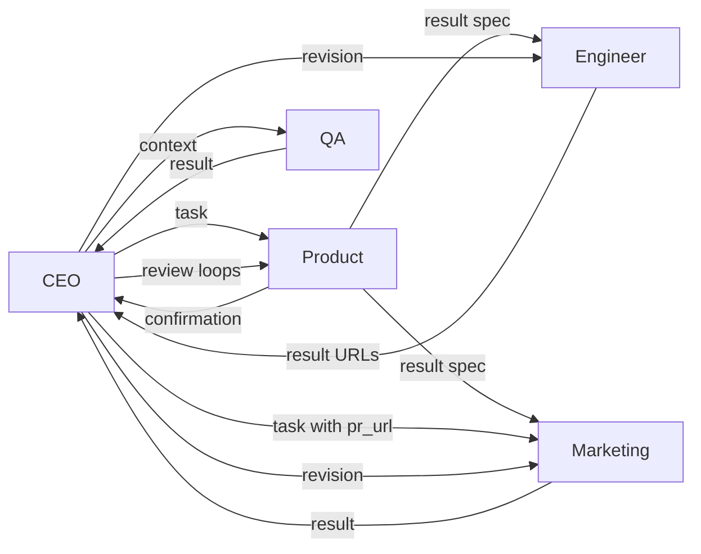

# LaunchMind

Multi-agent system that takes a startup **idea** and runs a micro-startup workflow: **Product** spec, **Engineer** landing page + real **GitHub** issue/branch/PR, **Marketing** cold email (**Resend**) + **Slack** Block Kit post (PR URL comes from the **CEO** only), **QA** inline PR comments, **CEO** orchestration with LLM reviews and multiple revision loops, and a final CEO summary to Slack.

Built with **FastAPI**, **LangChain Deep Agents** ([quickstart](https://docs.langchain.com/oss/python/deepagents/quickstart)), and **OpenAI-compatible** chat (`langchain-openai` `ChatOpenAI`, e.g. Metaminds `base_url`).

## Startup idea

Replace with your group’s concrete idea in the demo/README when you record; the pipeline accepts any non-empty string at runtime (`POST /runs` or `python main.py "..."`).

## Agent architecture



Messages on the bus follow PRD §4.1 (`models/messages.py`). Full history is returned in pipeline results for demos. Each run also writes **`output/<run_id>/`** (gitignored; see `OUTPUT_DIR` / `SAVE_RUN_LOGS` in `.env.example`): **`run_log.json`** (five agents up front, bus history), **`links.json`** / **`links.txt`** (PR, issue, branch), and **`index.html`** (saved copy of the landing page from the PR head when the run completes that far).

## Repository layout

| Path | Role |
|------|------|
| `main.py` | FastAPI `app`, `POST /runs`, `GET /runs/{job_id}`, and CLI demo |
| `message_bus.py` | PRD shim re-exporting `MessageBus` |
| `core/` | Settings, `MessageBus` implementation |
| `models/` | Pydantic models: bus messages (`messages.py`), agent JSON shapes (`agent_outputs.py`) |
| `services/pipeline.py` | Phase machine (ordering + CEO reviews) |
| `services/jobs.py` | In-memory job store |
| `services/run_log.py` | Per-run ``output/<id>/`` bundle (log, links, ``index.html``) |
| `services/github_service.py`, `slack_service.py`, `email_service.py` | Integrations |
| `agents/` | One Deep Agent builder per role |
| `prompts/` | Prompt strings only |

## Setup

1. Python 3.11+
2. Create a virtualenv and install:

```bash
cd LaunchMind
python -m venv .venv
source .venv/bin/activate   # Windows: .venv\Scripts\activate
pip install -e .
```

3. Copy `.env.example` → `.env` and fill in real values (never commit `.env`).

4. **GitHub**: public repo `launchmind-[group]`; classic PAT with `repo`, `workflow`.

5. **Slack**: Bot token with `chat:write`, `channels:read`, `channels:join`; channel `#launches`; invite the bot.

6. **Resend**: API key; with `onboarding@resend.dev`, **`TO_EMAIL` must be the same address as your Resend account** (testing restriction). To mail arbitrary inboxes, [verify a domain](https://resend.com/domains) and set `FROM_EMAIL` to an address on that domain.

## Run

**Synchronous demo (PRD / video):**

```bash
python main.py "Your startup idea here"
```

**HTTP API (async job):**

```bash
python main.py serve
# elsewhere:
curl -s -X POST http://127.0.0.1:8000/runs -H "Content-Type: application/json" \
  -d '{"idea":"Your startup idea"}'
curl -s http://127.0.0.1:8000/runs/<job_id>
```

## Platforms

| Platform | What agents do |
|----------|----------------|
| GitHub | Issue “Initial landing page”, branch, `index.html` commit, open PR; QA inline comments on HTML |
| Slack | Marketing launch blocks; CEO final summary |
| Resend | Cold outreach to `TO_EMAIL` (test inbox only) |

After a successful run, add your **PR link** to this README for submission.

## Tests

```bash
pip install pytest
pytest tests/
```

## Submission checklist (PRD §11)

- [ ] Public GitHub repo with this structure (`agents/`, `main.py`, `message_bus.py`, `.env.example`, `.gitignore`)
- [ ] Real PR opened by Engineer agent
- [ ] Slack messages visible (marketing + CEO summary)
- [ ] Email received
- [ ] Demo shows CEO feedback loop and bus traffic
- [ ] Demo video + portal links

## Slack workspace

_Add your workspace invite link or screenshots here._
